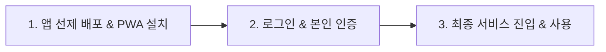
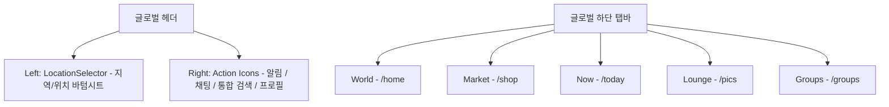

# World of Community (WoC) Information Architecture (IA)

> [!TIP]
> **GPT 기획 요청 가이드 (GPT Prompt Template)**
> 이 문서를 그대로 전체 복사하여 ChatGPT나 Claude 등 생성형 AI 서비스에 다음과 같이 프롬프트를 전송하십시오.
> ```text
> "아래의 WoC 플랫폼 최신 IA 설계 문서를 바탕으로, [원하는 추가 기능이나 수정사항]에 대한 세부 기능 기획서와 백엔드 데이터 모델링, 그리고 예외 처리 플로우를 상세하게 작성해줘."
> ```

---

## [Core Principle] WoC 플랫폼 온보딩 & PWA 설치 공식 표준 프로세스

World of Community (WoC) 플랫폼은 일반적인 웹 애플리케이션의 설치 권유 흐름(앱 사용 중 백그라운드 팝업 유도)을 철저히 배제하고, 기획자 스톤님의 비즈니스 철학에 근거하여 다음 **'앱 선제적 배포 및 설치 ➔ 로그인 인증 ➔ 서비스 사용'**의 독점적 3단계 온보딩 기조를 엄격하게 수호하고 강제합니다.



### 1단계: 앱 선제 배포 및 PWA 설치 (`App Distribution`)
- **라우트**: `/` (최상위 대문 경로)
- **동작 규칙**:
  - 사용자가 플랫폼에 최초 진입 시, 로그인 화면이나 메인 피드로 진입하기 전에 최상위 대문인 `/` 경로에서 **PWA 앱 설치 유도 화면**을 먼저 마주하게 됩니다.
  - **안드로이드 브라우저 환경**: 브라우저의 기본 설치 다이얼로그(`beforeinstallprompt`)를 강제 캡처 및 준비하여 하단 앱 설치 버튼 터치 시 즉각 트리거합니다.
  - **아이폰(Safari/iOS) 환경**: 겹겹이 쌓인 장식용 테두리 상자를 전격 해체한 깔끔한 기본 여백 레이아웃 속에서, 중복 설명이 완전히 배제된 **"홈 화면에 추가(Step 2)"** 일러스트 단독 가이드를 1화면 1뷰(스크롤 제로)로 시원하게 노출하여 설치를 최우선 유도합니다.
  - **캐시 복구 보장**: 설치가 완료되었거나 로컬 플래그가 가동되면 '축하합니다!' 화면을 띄워 두되, 사용자가 스마트폰에서 앱을 삭제했을 때 복귀할 수 있도록 **[재설치 하기]** 리셋 장치를 제공하여 최초 설치 화면으로 즉시 캐시 청소 후 회귀하도록 보장합니다.

### 2단계: 로그인 및 세션 장착 (`Sign-in & Verification`)
- **진입점**: 앱 설치를 무사히 마친 후, 홈 화면의 앱 단축 아이콘을 통해 앱을 직접 실행할 때 비로소 로그인 인증 화면에 도달합니다.
- **동작 규칙**:
  - **전화번호 자동입력 및 제안 원천 차단**: 이전 기입 정보 제안 팝업이 키보드를 넓게 덮어 시야를 가리고 오작동을 유발하는 UX 붕괴를 영구 방지하기 위해, 번호 입력부에는 **자동완성 차단 속성(`autoComplete="off"`)을 100% 강제 Enforce**합니다.
  - **인증 무결성**: 6자리 OTP 코드 완성 즉시 화면 전체 로딩 스피너 잠금 장치와 함께 세션 Persistence 처리를 진행합니다.

### 3단계: 최종 서비스 진입 및 라이브 사용 (`App Live Usage`)
- **최종 종착지 라우트**: **`/live`** (소셜 피드가 아닌 실시간 LIVE 페이지로 전격 일원화)
- **동작 규칙**:
  - **404 라우팅 충돌 원천 차단**: Next.js의 런타임 캐시 꼬임 및 Firebase 세션 초기화 타이밍 차이로 인한 자바스크립트 기반 404 라우터 충돌을 원천 차단하기 위해, 로그인 성공 즉시 `router.push` 대신 브라우저의 세션을 무결하게 동기화해 던지는 **`window.location.replace('/live')` 리다이렉션 기술로 100% 완전 통합 강제**합니다.

---

## [Business Standard] 커뮤니티 그룹 유형별 가입 표준 정책 (`membershipPolicy.joinStrategy`)

World of Community (WoC) 플랫폼은 그룹별 성격에 최적화된 온보딩 경험을 실현하기 위해, 데이터베이스 설계 규격인 `membershipPolicy.joinStrategy` 에 근거하여 다음 **'오픈형 / 승인대기형 / 비공개 초대형'**의 3대 그룹 가입 행태 표준을 엄격히 규정하고 집행합니다.

### 1. 오픈형 커뮤니티 (`joinStrategy: 'open'`)
- **개념**: 누구나 자유롭게 즉시 합류하여 활동할 수 있는 개방형 커뮤니티입니다.
- **UX 및 화면 행태**:
  - 미가입 사용자가 대문 페이지에서 가입하기 버튼을 클릭하면, 그 어떤 대기나 번거로운 질문 양식 없이 즉시 화면상에 **"가입이 성공적으로 완료되었습니다!"**라는 축하 팝업이 표출됩니다.
  - 가입 클릭 즉시 페이지 새로고침 없이 즉각 멤버 권한('member')으로 승격되며, 잠겨 있던 그룹 피드와 게시판 기능이 실시간 오픈되어 즉각 사용할 수 있습니다.
- **백엔드 데이터 및 알림 흐름**:
  - 클릭 즉시 Firestore의 group documents 내 `members` 리스트에 사용자 정보가 즉시 활성 상태(`status: 'active'`)로 자동 삽입 및 반영됩니다.
  - 별도의 수동 심사 요청이 가지 않으므로 실시간 어드민 알림은 생략되며, 그룹장에게는 "새로운 탱고 멤버가 합류하였습니다."라는 단순 축하 알림만 1회 전송됩니다.

### 2. 승인대기형 커뮤니티 (`joinStrategy: 'approval'`)
- **개념**: 그룹 대표 및 운영진의 수동 심사와 승인을 거쳐서만 구성원으로 합류할 수 있는 보안 관리형 커뮤니티입니다.
- **UX 및 화면 행태**:
  - 가입하기 버튼 터치 시, 가입 동기나 필수 사전 질문(예: 닉네임, 연락처 등)을 기입하는 바텀시트 신청서 모달이 트리거됩니다.
  - 신청서 제출 완료 즉시 화면에는 **"가입 신청서가 제출되었습니다. 그룹 대표의 심사 후 가입이 완료됩니다."**라는 대기 상태 안내가 노출됩니다.
  - 가입이 승인되기 전까지 사용자의 가입 상태는 대기(`status: 'pending'`)로 고정되며, 그룹 내부 게시판이나 피드 기능은 잠금 상태를 유지합니다.
- **백엔드 데이터 및 알림 흐름**:
  - 제출된 신청서는 Firestore의 대기 신청 수신함(`group_join_requests` 컬렉션)에 기록됩니다.
  - **실시간 푸시 알림(FCM)**을 통해 그룹 대표 및 스태프 전원에게 "신규 가입 신청서가 도착했습니다."라는 모바일 경보 알림을 실시간 전송합니다.
  - 그룹장의 어드민 페이지(`/groups/[id]?tab=admin`) 내 가입 회원 통제(`GroupMemberManager`) 장치에 신청자가 실시간 표출되며, 대표가 '수락'을 터치하면 최종 멤버로 승격되며 '가입이 완료되어 활동을 시작할 수 있습니다.'라는 축하 알림이 대상자에게 실시간 역발송됩니다.

### 3. 비공개 초대형 커뮤니티 (`joinStrategy: 'invite'`)
- **개념**: 외부 일반 사용자에게는 노출되지 않거나 임의 신청이 불가능하고, 오직 운영진의 직접적인 초대장을 통해서만 입장이 가능한 전용 폐쇄형 커뮤니티입니다.
- **UX 및 화면 행태**:
  - 일반 공개 탐색기 및 대문 화면에서는 가입하기 버튼 자체가 노출되지 않고 비활성화됩니다.
  - 오직 기존 운영진이 어드민 메뉴에서 발급한 비공개 링크나 메일 초대장을 터치하여 인입될 때만 특별 가입 활성화 통로가 열립니다.
- **백엔드 데이터 및 알림 흐름**:
  - 어드민이 초대장을 보낼 때 Firestore에 일회용 고유 초대 토큰이 난수 생성됩니다.
  - 가입 완료 즉시 해당 토큰이 소멸되며 정식 승인 멤버로 등록됩니다.

---

## 1. 전역 공통 레이아웃 & 내비게이션 (Global Overlay)

어떤 화면에서든 트리거되거나 노출되는 플랫폼 최상위 공통 내비게이션 뼈대입니다.



### 1.1 글로벌 상단 헤더 (Global Header)
- **좌측 영역 (Location)**: `LocationSelector` 바텀시트
  - 지역 이름(예: Seoul, South Korea 또는 All Tango Society) 클릭 시 위치 선택 모달이 활성화되어 데이터 컨텍스트를 글로벌/로컬 기준으로 분기 제어합니다.
- **우측 영역 (Action Icons)**:
  - **알림 센터 아이콘**: 클릭 시 알림 센터(`/notification`)로 이동합니다. 실시간 미확인 알림 개수를 나타내는 레드 배지가 표시됩니다.
  - **채팅 아이콘**: 클릭 시 실시간 채팅 목록(`/chat`)으로 이동합니다. 읽지 않은 메시지 개수를 나타내는 레드 배지가 표시됩니다.
  - **검색 아이콘**: 클릭 시 통합 검색 화면(`/search`)으로 이동합니다.
  - **내 프로필 아바타**: 클릭 시 마이 개인화 허브(`/profile?tab=schedule`)로 이동합니다.

### 1.2 글로벌 하단 탭바 (Global Footer Tabbar)
전역 화면 하단에 고정 탑재되는 5대 핵심 카테고리 탭입니다. 상세 페이지(Detail) 및 일부 관리자 화면(Admin) 진입 시에는 자동으로 숨김 처리됩니다.

---

## 2. 5대 전역 카테고리 & 서브 내비게이션 구조

하단 탭 선택 시 활성화되는 상단 서브 탭 내비게이션 구조 및 매핑 경로입니다.

```mermaid
graph TD
    TabWorld[1. World] --> W1[Society: /home]
    TabWorld --> W2[Plaza: /plaza]
    TabWorld --> W3[Venues: /venues]
    TabWorld --> W4[People: /people]

    TabMarket[2. Market] --> M1[Shop: /shop]
    TabMarket --> M2[Resale: /resale]
    TabMarket --> M3[Rental: /rental]
    TabMarket --> M4[Stay: /stay]

    TabNow[3. Now] --> N1[Today: /today]
    TabNow --> N2[Live: /live]
    TabNow --> N3[Social: /social]
    TabNow --> N4[Class: /class]
    TabNow --> N5[Events: /events]

    TabLounge[4. Lounge] --> L1[Pics: /pics]
    TabLounge --> L2[Lost: /lost]
    TabLounge --> L3[Hub: /hub]
    TabLounge --> L4[Jump: /explore]

    TabGroups[5. Groups] --> G1[Groups: /groups]
```



### 2.1 World 탭 (글로벌 소셜 메인)
- **Society** (`/home`)
  - **구성**: 글로벌/로컬 소사이어티 소식, 트렌딩 콘텐츠 아티클 및 브랜드 스토리텔링 매거진.
  - **모달**: `Music365Popup` (오늘의 음악 상세 플레이어), `TangoHistoryPopup` (오늘의 탱고 역사 팝업).
- **Plaza** (`/plaza`)
  - **구성**: 전체 회원이 자유롭게 공유하고 소통하는 통합 타임라인 피드.
  - **모달/오버레이**: `PostEditorModal` (전역 피드 작성/수정 모달), `PostDetailModal` (포스트 내용 상세 및 댓글 입력).
- **Venues** (`/venues`)
  - **구성**: 스튜디오, 연습실, 제휴 브랜드 상점 등 주변 공간 지도 연동 리스트 및 위치 태그.
- **People** (`/people`)
  - **구성**: 유력 인물 정보 디렉토리, 강사진 일정 연동 및 프로필 카드 리스트.
  - **모달**: `UserProfilePopup` (간편 프로필 상세 및 1:1 대화 연결).

### 2.2 Market 탭 (공유 경제 및 커머스)
- **Shop** (`/shop`)
  - **구성**: 커뮤니티 전용 의류, 신발, 잡화 및 매뉴얼 북 판매 상점.
  - **모달**: `ProductDetail` (상품 비주얼 갤러리 및 상세 옵션), `PurchaseFlow` (주문/결제 통합 바텀시트), `CreateProduct` (운영진용 상품 등록 모달).
- **Resale** (`/resale`)
  - **구성**: 멤버 간 1:1 안전 결제 기반 중고 제품 거래 마켓.
  - **모달**: `ResaleItemDetail` (제품 상세 정보 및 판매자 채팅 연동), `CreateResaleItem` (중고 거래 물품 등록 모달).
- **Rental** (`/rental`)
  - **구성**: 연습실 및 밀론가 공간 시간대별 렌탈 대여 예약 관리.
  - **모달**: `RentalDetail` (구비 장비 및 대여 가능 여부 상세), `RentalRequestFlow` (예약 날짜 선택 및 결제).
- **Stay** (`/stay`)
  - **구성**: 수련회, 행사 참가용 숙박 및 카우치서핑 통합 예약.
  - **모달**: `StayDetail` (날짜별 방 타입 및 요금 상세), `StayReservationFlow` (예약 및 결제 신청 바텀시트).

### 2.3 Now 탭 (실시간 이벤트 및 클래스)
- **Today** (`/today`)
  - **구성**: 오늘 하루 동안 진행되는 라이브, 소셜 파티, 아카데미 클래스 등 모든 오늘의 행사 종합 캘린더 피드.
- **Live** (`/live`)
  - **구성**: 현재 송출 중인 라이브 스트리밍, 예약 방송, 지난 녹화본 목록.
  - **모달**: `LiveStreamingViewer` (실시간 송출 시청 및 라이브 채팅 참여 전체 화면 모달).
- **Social** (`/social`)
  - **구성**: 소셜 모임 및 밀론가 파티 등 특별 이벤트 등록 및 입장권 예매.
  - **모달**: `SocialViewer` (이벤트 상세 정보, 티켓 수량 선택 및 결제), `EditSocialEvent` (등록/수정 에디터).
- **Class** (`/class`)
  - **구성**: 수강 일정 조회, 수강생 모집 정보 및 강좌 등록 신청.
  - **모달**: `ClassDetail` (주차별 미디어 라인, 커리큘럼, 수강료 및 강사 상세 모달), `WeeklyMediaEditor` (주차별 비디오/이미지 썸네일 등록 팝업).
- **Events** (`/events`)
  - **구성**: 지역 내 주요 행사 정보 목록 및 참가 티켓 등록 신청.

### 2.4 Lounge 탭 (아카이브 및 발견)
- **Pics** (`/pics`)
  - **구성**: 행사 및 파티 현장 스냅 사진 실시간 스트리밍 갤러리.
  - **모달**: `MediaGalleryViewer` (고화질 사진 다운로드 및 전체 화면 스와이프).
- **Lost & Found** (`/lost`)
  - **구성**: 분실물 습득 및 주인 탐색 전용 게시판.
  - **모달**: `LostFoundDetail` (분실 물품 상태 사진 및 습득/보관처 정보), `CreateLostItem` (분실물 등록 모달).
- **Hub** (`/hub`)
  - **구성**: 오프라인 제휴 공간 및 주요 글로벌 파트너를 위한 물류 허브 링크 목록.
- **Jump** (`/explore`)
  - **구성**: 다른 취미(요가, 살사, 자전거 등)의 소사이어티로 한 번에 전환하여 점프하는 탐색 통로.

### 2.5 Groups 탭 (커뮤니티 디렉토리)
- **Groups** (`/groups`)
  - **구성**: 플랫폼에 개설된 모든 소사이어티 그룹 목록 및 내가 가입된 그룹 간편 가입 처리.
  - **모달**: `CreateGroupModal` (그룹 테마색, 로고, 가입 방식 설정 모달).

---

## 3. My 개인화 허브 & 챗 / 알림 (My Workspace)

사용자 본인의 개인 지갑, 예약 이력, 1:1 실시간 대화 및 계정 설정을 통제하는 전용 영역입니다.

### 3.1 My 탭 메뉴 구조 (상단 프로필 진입)
- **Schedule** (`/profile?tab=schedule`)
  - **구성**: 내가 신청하여 가입 완료된 모든 클래스, 소셜 이벤트, 객실 및 렌탈 예약의 주간/월간 타임라인 스케줄러.
- **Coaching** (`/coaching`)
  - **구성**: 강사 또는 어드민과의 1:1 개인 피드백, 상담, 영상 분석 및 맞춤형 피드백 룸 목록.
- **My Live** (`/live?view=my`)
  - **구성**: 내가 예약한 방송 관리 및 직접 방송 송출 콘솔 제어.
- **Wallet** (`/wallet`)
  - **구성**: 가상 자산 잔액, 충전 내역, 티켓 예매 내역 및 정산 지급을 위한 계좌 등록(`BankSelectionEditor`).
- **My Info** (`/profile?tab=profile`)
  - **구성**: 아바타 및 간편 정보 수정(`MyInfoBottomSheet`), 개인정보 보호 동의 설정(`/privacy`), 회원 탈퇴 모달(`DeactivateBottomSheet`).

### 3.2 알림 센터 (`/notification`)
- **경로**: `/notification`
- **구조**: 전체(All) / 소셜(Social) / 이벤트(Events) / 시스템 공지(System) 분기형 탭.

### 3.3 실시간 챗 (`/chat`)
- **경로**: `/chat`
- **구조**: 1:1 DM 탭 / 그룹 채팅 탭. 클릭 시 전체 화면 채팅방(`ChatRoom`) 활성화.

---

## 4. 개별 그룹 내부 상세 구조 (Group Inner IA)

- **경로**: `/groups/[id]` (개별 그룹 메인 진입점)
- **특징**: 그룹 어드민이 활성화한 기능에 따라 상단 탭 메뉴가 Dynamic하게 온오프 및 정렬(`GroupModuleRenderer`)됩니다.

### 4.1 개별 그룹 내부 6대 핵심 모듈 (Group Inner Modules)

#### 1. Feed & Board (피드 및 일반 게시글)
- **역할**: 그룹원들이 자유롭게 글을 쓰고 사진을 업로드하여 일상을 공유하는 피드형 게시판.
- **모달**: `PostEditorModal` (글쓰기/수정), `PostDetailModal` (댓글 등록 및 상세 보기).

#### 2. Notice Board (공지사항)
- **역할**: 그룹 운영진이 작성한 공지사항 아카이브.
- **모달**: `AdminNoticeEditor` (어드민 전용 공지 글쓰기 모달).

#### 3. Album & Moments (미디어 갤러리)
- **역할**: 그룹 행사, 연습 등에서 촬영한 단체/인물 스냅 사진 공유 보관소.
- **모달**: `UploadGalleryModal` (다중 사진 업로드), `MediaGalleryViewer` (스와이프 뷰어).

#### 4. Classes & Academy (교육 및 아카데미)
- **역할**: 수강 일정 조회, 수강 신청/수강생 관리, 커리큘럼 제공.
- **대시보드 스펙**:
  - **와이드 카드**: 테두리와 섀도우를 입힌 가로형 카드 디자인 (둥근 점 인디케이터 전면 제거).
  - **성비 정보**: 남녀 참가자 수 및 성비 비율을 칩 레이아웃으로 탑재.
  - **가로 미디어라인**: 카드 하단에 주차별 수업 동영상을 바로 확인할 수 있는 미니 가로 썸네일 카루셀 탑재 (미등록 주차는 `COMING SOON`).
  - **숏컷 연동**: 썸네일 터치 시, 해당 주차가 활성화된 상태로 `ClassDetail` 모달 팝업으로 즉각 라우팅.
- **모달**: `GroupClassEditor` (수강료/정원 관리), `ClassDetail` (커리큘럼 및 동영상 플레이어), `WeeklyMediaEditor` (주차별 동영상/이미지 업로드).

#### 5. Calendar & Booking (일정 및 예약)
- **역할**: 그룹의 정기 일정, 쁘락띠까 연습, 엠티/합숙 등 단체 행사 캘린더.
- **모달**: `GroupCalendarForm` (캘린더 등록 및 숙소 예약 연동), `EventDetailBottomSheet` (참가 신청/접수).

#### 6. Team Workspace (협업 및 태스크)
- **역할**: 그룹 운영 스태프들을 위한 실시간 프로젝트 태스크 관리.
- **모달**: `SprintBoard` (칸반보드 드래그앤드롭), `TaskManager` (업무 할당 및 마감 관리).

### 4.2 그룹 어드민 설정 제어 (Group Admin Panel)
- **진입**: `/groups/[id]?tab=admin` (그룹 대표 전용 권한)
- **어드민 메뉴 일람**:
  - **Module Configuration**: `GroupFunctionBuilder` (피드, 알림, 쇼핑, 숙박 등 그룹 내 활성화할 메뉴 탭 선택 및 드래그 정렬 빌더).
  - **Member Management**: `GroupMemberManager` (가입 신청 대기 회원 수락/거절 및 그룹 등급 제어).
  - **Finance & Tuition**: `TuitionManager` (수강생 입금 매칭 및 미납 알림), `PayrollTracker` (강사료 지급 비율 설정).
  - **Group Design**: `GroupDesignEditor` (Stitch 디자인 스펙 기반 헤더 색상, 폰트 및 태그 커스텀).

---

## 5. 플랫폼 시스템 어드민 (Backoffice Admin)

- **경로**: `/admin` (플랫폼 총괄 최고관리자 권한 필요)
- **서브 메뉴 및 매핑 모달 흐름**:
  - **banners** (`/admin/banners`): 글로벌 메인 배너 슬라이더 등록 모달(`BannerEditorModal`).
  - **people** (`/admin/people`): 전체 가입자 권한 수동 조율 및 차단/해제(`UserLevelManager`).
  - **pics** (`/admin/pics`): 사진 라이브러리 검수 및 자동 크롭 가이드라인 조정(`SafeZoneEditor`).
  - **place** (`/admin/place`): 지도 장소 검수 및 신규 연습 장소 등록.
  - **others** (`/admin/others`): 대량 사진 업로드 모달(`ImportPackModal`) 및 서버 리소스 초기화.
