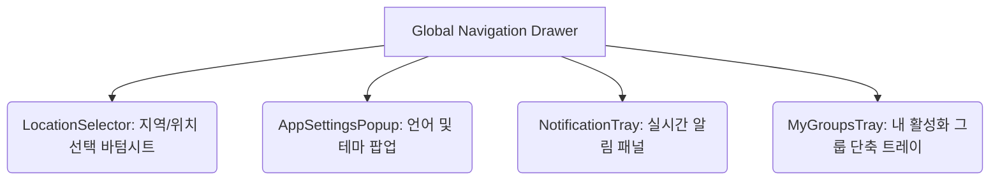

# World of Community (WoC) Information Architecture (IA)

이 문서는 World of Community (WoC) 글로벌 통합 커뮤니티 플랫폼의 전체 메뉴 구조, 세부 탭 흐름, 그리고 등록/수정창, 상세보기창, 바텀시트를 포함한 오버레이 모달까지 물리적 구조와 함께 상세하게 규정합니다.

---

## [Core Principle] WoC 플랫폼 온보딩 & PWA 설치 공식 표준 프로세스

World of Community (WoC) 플랫폼은 일반적인 웹 애플리케이션의 설치 권유 흐름(앱 사용 중 백그라운드 팝업 유도)을 철저히 배제하고, 기획자 스톤님의 비즈니스 철학에 근거하여 다음 **'앱 선제적 배포 및 설치 ➔ 로그인 인증 ➔ 서비스 사용'**의 독점적 3단계 온보딩 기조를 엄격하게 수호하고 강제합니다.

이 프로세스는 플랫폼의 최고 존엄 설계 원칙이며, 어떤 에이전트나 개발자도 일반적인 서비스 워커 권유 흐름으로 임의 변경해서는 안 됩니다.


### 1단계: 앱 선제 배포 및 PWA 설치 (`App Distribution`)
- **라우트**: `/` (최상위 대문 경로)
- **동작 규칙**:
  - 사용자가 플랫폼에 최초 진입 시, 로그인 화면이나 메인 피드로 진입하기 전에 최상위 대문인 `/` 경로에서 **PWA 앱 설치 유도 화면**을 먼저 마주하게 됩니다.
  - **안드로이드 브라우저 환경**: 브라우저의 기본 설치 다이얼로그(`beforeinstallprompt`)를 강제 캡처 및 준비하여 하단 앱 설치 버튼 터치 시 즉각 트리거합니다.
  - **아이폰(Safari/iOS) 환경**: 겹겹이 쌓인 장식용 테두리 상자를 전격 해체한 깔끔한 기본 여백 레이아웃 속에서, 중복 설명이 완전히 배제된 **"홈 화면에 추가(Step 2)"** 일러스트 단독 가이드를 1화면 1뷰(스크롤 제로)로 시원하게 노출하여 설치를 최우선 유도합니다.
  - **캐시 복구 보장**: 설치가 완료되었거나 로컬 플래그가 가동되면 '축하합니다!' 화면을 띄워 두되, 사용자가 스마트폰에서 앱을 삭제했을 때 복귀할 수 있도록 **[재설치 하기]** 리셋 장치를 제공하여 최초 설치 화면으로 즉시 캐시 청소 후 회귀하도록 보장합니다.

### 2단계: 로그인 및 세션 장착 (`Sign-in & Verification`)
- **진입점**: 앱 설치를 무사히 마친 후, 홈 화면의 앱 단축 아이콘을 통해 앱을 직접 실행할 때 비로소 로그인 인증 화면에 도달합니다.
- **동작 규칙**:
  - **전화번호 자동입력 및 제안 원천 차단**: 이전 기입 정보 제안 팝업이 키보드를 넓게 덮어 시야를 가리고 오작동을 유발하는 UX 붕괴를 영구 방지하기 위해, 번호 입력부에는 **자동완성 차단 속성(`autoComplete="off"`)을 100% 강제 Enforce**합니다.
  - **인증 무결성**: 6자리 OTP 코드 완성 즉시 화면 전체 로딩 스피너 잠금 장치와 함께 세션 Persistence 처리를 진행합니다.

### 3단계: 최종 서비스 진입 및 라이브 사용 (`App Live Usage`)
- **최종 종착지 라우트**: **`/live`** (소셜 피드가 아닌 실시간 LIVE 페이지로 전격 일원화)
- **동작 규칙**:
  - **404 라우팅 충돌 원천 차단**: Next.js의 런타임 캐시 꼬임 및 Firebase 세션 초기화 타이밍 차이로 인한 자바스크립트 기반 404 라우터 충돌을 원천 차단하기 위해, 로그인 성공 즉시 `router.push` 대신 브라우저의 세션을 무결하게 동기화해 던지는 **`window.location.replace('/live')` 리다이렉션 기술로 100% 완전 통합 강제**합니다.

---

## [Business Standard] 커뮤니티 그룹 유형별 가입 표준 정책 (`membershipPolicy.joinStrategy`)

World of Community (WoC) 플랫폼은 그룹별 성격에 최적화된 온보딩 경험을 실현하기 위해, 데이터베이스 설계 규격인 `membershipPolicy.joinStrategy` 에 근거하여 다음 **'오픈형 / 승인대기형 / 비공개 초대형'**의 3대 그룹 가입 행태 표준을 엄격히 규정하고 집행합니다.

### 1. 오픈형 커뮤니티 (`joinStrategy: 'open'`)
- **개념**: 누구나 자유롭게 즉시 합류하여 활동할 수 있는 개방형 커뮤니티입니다.
- **UX 및 화면 행태**:
  - 미가입 사용자가 대문 페이지에서 가입하기 버튼을 클릭하면, 그 어떤 대기나 번거로운 질문 양식 없이 즉시 화면상에 **"가입이 성공적으로 완료되었습니다!"**라는 축하 팝업이 표출됩니다.
  - 가입 클릭 즉시 페이지 새로고침 없이 즉각 멤버 권한('member')으로 승격되며, 잠겨 있던 그룹 피드와 게시판 기능이 실시간 오픈되어 즉각 사용할 수 있습니다.
- **백엔드 데이터 및 알림 흐름**:
  - 클릭 즉시 Firestore의 group documents 내 `members` 리스트에 사용자 정보가 즉시 활성 상태(`status: 'active'`)로 자동 삽입 및 반영됩니다.
  - 별도의 수동 심사 요청이 가지 않으므로 실시간 어드민 알림은 생략되며, 그룹장에게는 "새로운 탱고 멤버가 합류하였습니다."라는 단순 축하 알림만 1회 전송됩니다.

### 2. 승인대기형 커뮤니티 (`joinStrategy: 'approval'`)
- **개념**: 그룹 대표 및 운영진의 수동 심사와 승인을 거쳐서만 구성원으로 합류할 수 있는 보안 관리형 커뮤니티입니다.
- **UX 및 화면 행태**:
  - 가입하기 버튼 터치 시, 가입 동기나 필수 사전 질문(예: 닉네임, 연락처 등)을 기입하는 바텀시트 신청서 모달이 트리거됩니다.
  - 신청서 제출 완료 즉시 화면에는 **"가입 신청서가 제출되었습니다. 그룹 대표의 심사 후 가입이 완료됩니다."**라는 대기 상태 안내가 노출됩니다.
  - 가입이 승인되기 전까지 사용자의 가입 상태는 대기(`status: 'pending'`)로 고정되며, 그룹 내부 게시판이나 피드 기능은 잠금 상태를 유지합니다.
- **백엔드 데이터 및 알림 흐름**:
  - 제출된 신청서는 Firestore의 대기 신청 수신함(`group_join_requests` 컬렉션)에 기록됩니다.
  - **실시간 푸시 알림(FCM)**을 통해 그룹 대표 및 스태프 전원에게 "신규 가입 신청서가 도착했습니다."라는 모바일 경보 알림을 실시간 전송합니다.
  - 그룹장의 어드민 페이지(`/groups/[id]?tab=admin`) 내 가입 회원 통제(`GroupMemberManager`) 장치에 신청자가 실시간 표출되며, 대표가 '수락'을 터치하면 최종 멤버로 승격되며 '가입이 완료되어 활동을 시작할 수 있습니다.'라는 축하 알림이 대상자에게 실시간 역발송됩니다.

### 3. 비공개 초대형 커뮤니티 (`joinStrategy: 'invite'`)
- **개념**: 외부 일반 사용자에게는 노출되지 않거나 임의 신청이 불가능하고, 오직 운영진의 직접적인 초대장을 통해서만 입장이 가능한 전용 폐쇄형 커뮤니티입니다.
- **UX 및 화면 행태**:
  - 일반 공개 탐색기 및 대문 화면에서는 가입하기 버튼 자체가 노출되지 않고 비활성화됩니다.
  - 오직 기존 운영진이 어드민 메뉴에서 발급한 비공개 링크나 메일 초대장을 터치하여 인입될 때만 특별 가입 활성화 통로가 열립니다.
- **백엔드 데이터 및 알림 흐름**:
  - 어드민이 초대장을 보낼 때 Firestore에 일회용 고유 초대 토큰이 난수 생성됩니다.
  - 가입 완료 즉시 해당 토큰이 소멸되며 정식 승인 멤버로 등록됩니다.

---

## 1. 전역 내비게이션 & 공통 모달 (Global Overlay)

어떤 화면에서든 트리거되거나 내비게이션 드로어를 통해 진입할 수 있는 플랫폼 공통 오버레이 흐름입니다.



- **NavigationDrawer** (전체 햄버거 메뉴)
  - 연동 흐름: 전역 하단 탭바 우측 `More` 클릭시 슬라이딩 활성화됩니다.
- **NotificationTray** (전역 알림 패널 오버레이)
  - 연동 흐름: 헤더 영역 종 아이콘 클릭 시 활성화됩니다.
- **LocationSelector** (지역/위치 선택 바텀시트)
  - 연동 흐름: 헤더 영역 지구본/지역 이름 클릭 시 슬라이드 업 활성화됩니다.
- **AppSettingsPopup** (앱 설정 팝업)
  - 연동 흐름: 드로어 내 톱니바퀴 클릭 시 다국어(한국어/영어) 및 다크모드를 변경합니다.
- **MyGroupsTray** (내 그룹 목록 단축 오버레이)
  - 연동 흐름: 좌측 상단 그룹 숏컷 클릭 시 렌더링됩니다.

---

## 2. 17대 대메뉴 및 화면 계층 구조

모든 대메뉴는 [라우트 경로], [하위 탭 구성], [트리거 모달/바텀시트 흐름]을 완전하게 포함합니다.

### 2.1 랜딩 & 홈 (`/`, `/home`)
- **경로**: `/` (스플래시) ➔ `/home` (메인 대시보드)
- **화면 내 탭 구성**
  - **Dashboard 탭**: 전체 요약, 내 활동 지표, 최근 알림 요약 정보
- **PWA 설치 및 동작 제약 규칙**:
  - **앱 설치 후 앱사용 안내만 하고 절대 웹에서 앱의 인증페이지로 넘어가지 않는다.**
- **연계 모달 및 바텀시트 흐름**
  - `[등록/수정창]`: 없음.
  - `[상세보기창]`: `Music365Popup` (오늘의 음악 상세 플레이어 팝업), `TangoHistoryPopup` (오늘의 커뮤니티 역사 팝업)
  - `[기타 팝업]`: `PWAInstallPrompt` (웹 앱 설치 유도 바텀시트)

### 2.2 글로벌 검색 & 탐색 (`/explore`, `/search`)
- **경로**: `/explore` (발견) ➔ `/search` (통합 검색)
- **화면 내 탭 구성**
  - **All 탭**: 검색 결과 전체 요약 정보
  - **Groups 탭**: 필터링된 커뮤니티 그룹 목록
  - **Venues 탭**: 태그별 주변 공간 및 지도 연동 리스트
  - **People 탭**: 매칭 가능한 가입 회원 프로필 리스트
- **연계 모달 및 바텀시트 흐름**
  - `[등록/수정창]`: 없음.
  - `[상세보기창]`: `UserProfilePopup` (회원 간편 프로필 팝업)
  - `[기타 팝업]`: `FilterBottomSheet` (검색 정렬 및 범위 설정 바텀시트)

### 2.3 알림 센터 (`/notification`)
- **경로**: `/notification`
- **화면 내 탭 구성**
  - **All 탭**: 전체 알림 목록
  - **Social 탭**: 라이크, 댓글, 피드 소식 알림 목록
  - **Events 탭**: 클래스, 숙박, 대여 관련 소식 목록
  - **System 탭**: 관리자 공지 및 시스템 오류 보고 목록
- **연계 모달 및 바텀시트 흐름**
  - `[등록/수정창]`: 없음.
  - `[상세보기창]`: 클릭 시 알림과 관련된 상세 페이지(예: `/history`)로 전향 라우팅을 수행합니다.

### 2.4 활동 역사 기록 (`/history`)
- **경로**: `/history`
- **화면 내 탭 구성**
  - **Class 탭**: 수강 신청 완료 및 진행 중인 클래스 목록
  - **Stay 탭**: 객실 예약 완료 및 과거 숙박 이력
  - **Shop 탭**: 쇼핑몰 주문 상세 내역 및 배송 상태 정보
  - **Social 탭**: 예약한 소셜 모임 목록
- **연계 모달 및 바텀시트 흐름**
  - `[상세보기창]`: `StayDetailViewer` (숙소 예약 상세 영수증 팝업), `ShopOrderDetailViewer` (쇼핑 주문 상세 영수증 팝업)

### 2.5 전역 광장 피드 & 채팅 (`/plaza`, `/chat`)
- **경로**: `/plaza` (광장) ➔ `/chat` (실시간 통신)
- **화면 내 탭 구성 (`/chat`)**
  - **Direct Message 탭**: 개인 간 1:1 메시지방 리스트
  - **Group Chat 탭**: 가입된 그룹별 실시간 채팅방 목록
- **연계 모달 및 바텀시트 흐름**
  - `[등록/수정창]`: `PostEditorModal` (전역 피드 글 작성 및 수정 모달)
  - `[상세보기창]`: `PostDetailModal` (포스트 내용 상세 및 실시간 댓글 바텀시트), `ChatRoom` (개별 채팅방 전체 화면 레이아웃)
  - `[기타 팝업]`: `MemberProfileOverlay` (채팅방 내 회원 프로필 간편 조회 바텀시트)

### 2.6 라이브 스트리밍 (`/live`)
- **경로**: `/live` ➔ `/live/create` (생성 페이지)
- **화면 내 탭 구성**
  - **Active 탭**: 현재 송출 중인 라이브 목록
  - **Scheduled 탭**: 예약된 라이브 방송 목록
  - **Replay 탭**: 지난 라이브 녹화본 목록
- **연계 모달 및 바텀시트 흐름**
  - `[등록/수정창]`: `LiveStreamingEditor` (방송 정보 수정 및 커버 이미지 등록 바텀시트)
  - `[상세보기창]`: `LiveStreamingViewer` (실시간 방송 시청 및 라이브 채팅 참여 전체 모달)

### 2.7 회원 디렉토리 (`/people`)
- **경로**: `/people` ➔ `/people/register` (초대) ➔ `/people/[id]` (회원 프로필 상세)
- **화면 내 탭 구성 (`/people/[id]`)**
  - **Profile 탭**: 소개글 및 개인 경력 정보
  - **Groups 탭**: 해당 회원이 소속되거나 가입된 그룹 목록
  - **Posts 탭**: 해당 회원이 전역 광장 및 그룹 피드에 쓴 글
  - **Classes 탭**: 강사로서 등록한 클래스 또는 학생으로 참여한 수강 리스트
- **연계 모달 및 바텀시트 흐름**
  - `[등록/수정창]`: `NamecardModal` (나만의 명함 디자인 편집 및 수정 모달)
  - `[상세보기창]`: `UserProfileModal` (다른 회원 정보 상세 뷰어 다이얼로그)
  - `[기타 팝업]`: `MyInfoBottomSheet` (본인 정보 및 아바타 간편 변경 바텀시트)

### 2.8 소셜 포스터 이벤트 (`/social`)
- **경로**: `/social`
- **화면 내 탭 구성**
  - **Calendar 탭**: 날짜별 소셜 모임 및 파티 일정 달력
  - **Poster List 탭**: 비주얼 카드 방식의 소셜 포스터 리스트
- **연계 모달 및 바텀시트 흐름**
  - `[등록/수정창]`: `EditSocialEvent` (소셜 등록/수정 및 예매 티켓 생성 다이얼로그)
  - `[상세보기창]`: `SocialViewer` (소셜 이벤트 상세 정보 및 결제 진입 바텀시트), `SocialDjLineupSheet` (DJ 라인업 상세 정보 바텀시트)
  - `[기타 팝업]`: `SocialDownloadModal` (모임 안내 포스터 이미지 파일 저장 및 공유 모달), `PosterOverlay` (포스터 자동 생성용 그래픽 에디터 오버레이)

### 2.9 마켓 쇼핑몰 (`/shop`)
- **경로**: `/shop`
- **화면 내 탭 구성**
  - **All 탭**: 전체 상품 목록
  - **Fashion 탭**: 의류 상품
  - **Shoes 탭**: 탱고화 및 전용 신발
  - **Accessories 탭**: 잡화 소품
  - **Books 탭**: 커뮤니티 전용 매뉴얼 및 도서
- **연계 모달 및 바텀시트 흐름**
  - `[등록/수정창]`: `CreateProduct` (상품 등록 및 재고 수량 편집 모달)
  - `[상세보기창]`: `ProductDetail` (상품 비주얼 갤러리 및 상세 옵션 모달)
  - `[기타 팝업]`: `PurchaseFlow` (수량 지정, 카드 등록, 주소지 입력 및 주문 완료 통합 바텀시트), `WishlistTray` (장바구니 및 관심 상품 임시 보관함 트레이)

### 2.10 중고 거래 마켓 (`/resale`)
- **경로**: `/resale`
- **화면 내 탭 구성**
  - **Buy 탭**: 판매 중인 중고 제품 목록
  - **Sell 탭**: 내가 등록한 중고 거래 판매글 관리 목록
- **연계 모달 및 바텀시트 흐름**
  - `[등록/수정창]`: `CreateResaleItem` (중고 거래 등록/수정 및 가격 설정 모달)
  - `[상세보기창]`: `ResaleItemDetail` (중고 제품 상태 및 1:1 채팅 연동 상세 모달)
  - `[기타 팝업]`: `ResalePurchaseFlow` (직거래 및 안전 결제 선택 진행 바텀시트), `ResaleWishlistTray` (찜한 중고 거래 품목 리스트)

### 2.11 대여 공간 & 장소 (`/rental`, `/venues`)
- **경로**: `/rental` (물품/공간 대여) ➔ `/rental/register` (등록) ➔ `/rental/[id]` (상세)
- **화면 내 탭 구성 (`/venues` 지도 화면)**
  - **Map 탭**: 주변 공간/장소 지도 렌더링
  - **List 탭**: 등록된 공간 정보 요약 카드 리스트
- **연계 모달 및 바텀시트 흐름**
  - `[등록/수정창]`: `CreateRentalSpace` (대여 가능한 밀론가 공간/연습실 등록 모달)
  - `[상세보기창]`: `RentalDetail` (공간 구비 장비 및 시간대별 대여 가능 상세 모달)
  - `[기타 팝업]`: `RentalRequestFlow` (대여 시작/종료일 선택 및 결제 신청 바텀시트), `RentalWishlistTray` (관심 등록 대여 장소 보관함)

### 2.12 숙박 & 수련회 (`/stay`)
- **경로**: `/stay` ➔ `/stay/[id]` (상세) ➔ `/stay/[id]/checkout` (체크아웃) ➔ `/stay/[id]/checkout/complete` (완료)
- **화면 내 탭 구성**
  - **All Stay 탭**: 등록된 전역 수련 객실 목록
  - **Group Stay 탭**: 특정 그룹 전용 펜션/숙박 정보 목록
- **연계 모달 및 바텀시트 흐름**
  - `[등록/수정창]`: `CreateStay` (신규 객실 및 숙박 정보 등록/수정 모달)
  - `[상세보기창]`: `StayDetail` (날짜별 방 타입 및 요금 조회 상세 모달)
  - `[기타 팝업]`: `StayReservationFlow` (예약 날짜 변경 및 호스트 문의 바텀시트), `StayWishlistTray` (관심 등록 객실 목록)

### 2.13 클래스 아카데미 (`/class`)
- **경로**: `/class` ➔ `/class/[groupId]` (그룹 개별 클래스 목록)
- **화면 내 탭 구성 (`/class/[groupId]`)**
  - **Open Classes 탭**: 수강 신청 모집 중인 강좌 목록
  - **Closed Classes 탭**: 모집 종료 및 진행 중인 강좌 목록
- **연계 모달 및 바텀시트 흐름**
  - `[상세보기창]`: `ClassDetail` (커리큘럼, 강사 소개, 수업 시간 상세 정보 모달)
  - `[기타 팝업]`: `ClassRegistrationFlow` (수강생 이름 입력 및 수강료 결제 신청 바텀시트)

### 2.14 분실물 보관 센터 (`/lost`)
- **경로**: `/lost` ➔ `/lost/register` (등록) ➔ `/lost/[id]` (상세)
- **화면 내 탭 구성**
  - **Lost 탭**: 분실한 물건을 찾는 게시글 목록
  - **Found 탭**: 습득한 물건을 주인에게 돌려주기 위한 게시글 목록
- **연계 모달 및 바텀시트 흐름**
  - `[등록/수정창]`: `CreateLostItem` (분실 장소, 시간, 보관 위치 등록 모달)
  - `[상세보기창]`: `LostFoundDetail` (분실 물품 상태 사진 및 습득 보관처 정보 상세 모달)
  - `[기타 팝업]`: `LostClaimFlow` (소유자 본인 인증 및 습득자와 1:1 대화 연결 바텀시트)

### 2.15 커뮤니티 그룹 디렉토리 (`/groups`)
- **경로**: `/groups` ➔ `/groups/[id]` (개별 그룹 메인 진입점)
- **화면 내 탭 구성 (`/groups` 전체)**
  - **Popular 탭**: 인기 급상승 활성 커뮤니티 그룹
  - **My Groups 탭**: 내가 현재 가입하여 활동 중인 그룹 목록
- **연계 모달 및 바텀시트 흐름**
  - `[등록/수정창]`: `CreateGroupModal` (그룹 테마색, 로고, 가입 질문 설정 모달)

### 2.16 마이 프로필 & 지갑 (`/profile`, `/wallet`, `/privacy`)
- **경로**: `/profile` (내 정보) ➔ `/wallet` (자산) ➔ `/privacy` (개인정보 보호)
- **화면 내 탭 구성 (`/profile`)**
  - **Account 탭**: 이메일, 전화번호 등 기본 계정 정보
  - **Groups 탭**: 가입된 그룹 및 관리자 권한 여부 확인
  - **Settings 탭**: 전역 알림 발송 온/오프 토글 스위치 설정
- **연계 모달 및 바텀시트 흐름**
  - `[등록/수정창]`: `MyInfoBottomSheet` (프로필 사진 업로드 및 닉네임 수정 바텀시트)
  - `[상세보기창]`: 없음.
  - `[기타 팝업]`: `DeactivateBottomSheet` (계정 비활성화 및 영구 탈퇴 처리 바텀시트), `BankSelectionEditor` (지급 및 정산을 위한 개인 계좌/은행 정보 에디터)

### 2.17 플랫폼 어드민 시스템 (`/admin`)
- **경로**: `/admin` (메인 대시보드) ➔ `/admin/[sub-path]` (기능별 어드민)
- **화면 내 하위 경로 일람**
  - `/admin/banners` (글로벌 배너 에디터)
  - `/admin/people` (전체 가입자 권한 변경)
  - `/admin/pics` (소셜 사진 라이브러리 검수)
  - `/admin/place` (지도 장소 검수 및 등록)
  - `/admin/others` (앱 패치 공지 및 기타 시스템 리소스 구성)
- **연계 모달 및 바텀시트 흐름**
  - `[등록/수정창]`: `BannerEditorModal` (전역 배너 슬라이더 등록 모달), `SafeZoneEditor` (사진 이미지 세이프 크롭 가이드라인 조정 모달)
  - `[상세보기창]`: `UserLevelManager` (가입 유저 차단 및 등급 승급 제어 상세 팝업)
  - `[기타 팝업]`: `ImportPackModal` (대량 사진 파일 업로드 및 압축 해제 처리 모달)

---

## 3. 개별 그룹 내부 상세 구조 (Group Inner IA)

- **공통 진입 경로**: `/groups/[id]`
- **특징**: `GroupHome` 컴포넌트 내부에서 활성화된 기능에 따라 탭바 메뉴가 동적으로 구성됩니다.

```mermaid
graph TD
    Home[Group Home Entry: /groups/id] --> F1(Feed & Notices: 공지 및 일반 글)
    Home F2(Education: 클래스 연동)
    Home F3(Booking & Events: 달력 및 이벤트)
    Home F4(Work & Collaboration: 업무 및 태스크 관리)
    Home F5(Settings: 어드민 제어 센터)
```

### 3.1 그룹 내부 화면 구성 탭 (Dynamic Module Tabs)

#### 1. Feed & Board 탭 (피드 및 게시판)
- **제공 기능**: 공지 게시판, 사진첩, 일반 소통 자유게시판을 결합한 통합 타임라인입니다.
- **연계 모달 및 바텀시트 흐름**
  - `[등록/수정창]`: `PostEditorModal` (그룹원 및 관리자 전용 포스트 등록 및 수정 모달)
  - `[상세보기창]`: `PostDetailModal` (댓글 입력 및 조회용 글 상세보기 모달)

#### 2. Notice Board 탭 (공지사항)
- **제공 기능**: 강사진 및 운영진이 작성한 중요 필독 공지 목록입니다.
- **연계 모달 및 바텀시트 흐름**
  - `[등록/수정창]`: `AdminNoticeEditor` (어드민 공지 작성 모달)
  - `[상세보기창]`: `PostDetailModal` (댓글은 비활성화 가능하며 공지 정밀 보기 수행)

#### 3. Album & Moments 탭 (미디어 갤러리)
- **제공 기능**: 그룹 행사 및 밀론가 파티에서 공유된 회원 실시간 촬영 사진 보관소입니다.
- **연계 모달 및 바텀시트 흐름**
  - `[등록/수정창]`: `UploadGalleryModal` (다중 사진 파일 업로드 모달)
  - `[상세보기창]`: `MediaGalleryViewer` (고화질 스와이프 사진 다운로드 뷰어 모달)

#### 4. Classes 탭 (교육 아카데미)
- **제공 기능**: 그룹 내에서 정식 개설한 단계별 강좌 스케줄 및 신청 리스트입니다.
- **연계 모달 및 바텀시트 흐름**
  - `[등록/수정창]`: `GroupClassEditor` (수강료, 강사, 최대 인원, 일정 등록 및 편집 통합 모달)
  - `[상세보기창]`: `ClassDetail` (커리큘럼 및 클래스 세부 일정 정보 팝업)
  - `[기타 팝업]`: `ClassRegistrationFlow` (결제 및 수강 완료 바텀시트)

#### 5. Calendar & Booking 탭 (그룹 달력)
- **제공 기능**: 그룹이 주최하는 전체 워크샵 및 정기 모임 통합 달력입니다.
- **연계 모달 및 바텀시트 흐름**
  - `[등록/수정창]`: `GroupCalendarForm` (신규 캘린더 이벤트 등록 및 리트릿 숙소 예약 동시 연동 에디터)
  - `[상세보기창]`: `EventDetailBottomSheet` (일정별 참가 희망자 접수 및 장소 링크 상세 보기 바텀시트)

#### 6. Team Workspace 탭 (태스크 & 협업)
- **제공 기능**: 그룹 스태프 및 조기 파트너들을 위한 실시간 프로젝트 업무 스페이스입니다.
- **연계 모달 및 바텀시트 흐름**
  - `[등록/수정창]`: `TaskManager` / `SprintBoard` (신규 스태프 업무 생성 및 상태 변경 드래그 앤 드롭 모달)
  - `[상세보기창]`: `TaskDetailBottomSheet` (작업 마감일 및 담당 스태프 배정 상세 바텀시트)

---

## 4. 개별 그룹 어드민 상세 설계 (Group Admin IA)

그룹 관리자가 대시보드 및 설정을 제어하기 위한 서브 플로우 맵입니다.

### 4.1 그룹 설정 관리 제어
- **경로**: `/groups/[id]?tab=admin` ➔ `GroupSettings` 진입
- **서브 메뉴 및 매핑 모달 흐름**
  - **Module Configuration (기능 스위처)**
    - `[등록/수정창]`: `GroupFunctionBuilder` (피드, 알림, 쇼핑, 숙박 등 그룹 내 활성화할 메뉴 탭을 선택하고 Drag로 우선순위를 결정하는 빌더 모달)
  - **Member Management (가입 회원 통제)**
    - `[등록/수정창]`: 없음.
    - `[상세보기창]`: `GroupMemberManager` (가입 신청 수락/거절 및 그룹 등급 조정 다이얼로그)
  - **Finance & Tuition (회비 및 강사료 정산)**
    - `[등록/수정창]`: `TuitionManager` (수강생 입금 검증 및 미납 체크), `PayrollTracker` (강사료 지급 비율 설정)
    - `[상세보기창]`: `SettlementReports` (그룹 내 모든 도메인 거래 금액 일간/월간 수지 분석 리포트 오버레이)
  - **Group Design (커버 및 레이아웃 커스텀)**
    - `[등록/수정창]`: `GroupDesignEditor` (Stitch 디자인 스펙을 적용하여 헤더 색상, 폰트, 커뮤니티 성격 태그를 수정하는 레이아웃 커스터마이저 모달)
