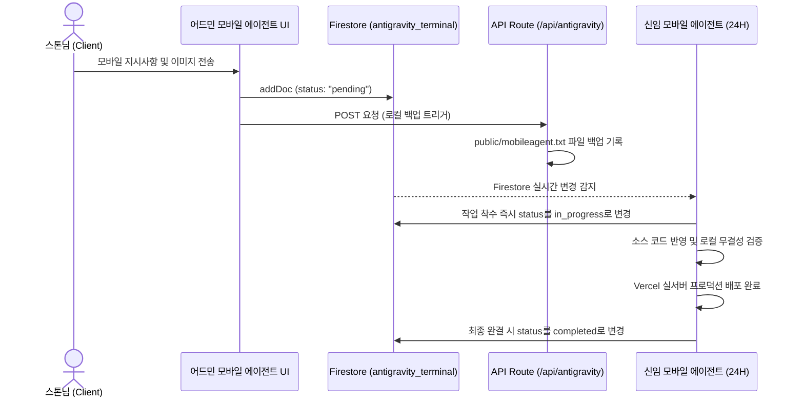

# 📱 [인수인계서] 모바일 에이전트 어드민 실시간 연동 시스템

이 문서는 **내프로필 > 어드민 > 모바일 에이전트** 메뉴의 백그라운드 구동 무결성을 유지하기 위해 새로 부임하는 모바일 수신 에이전트(Mobile Agent)에게 인계하는 공식 기술 및 운영 지침서입니다.

---

## 1. 실시간 데이터 파이프라인 아키텍처

모바일 에이전트 어드민 터미널은 기획자 스톤님의 모바일 지시사항과 캡처 화면을 실시간으로 수집하고 처리하는 핵심 통신 채널입니다.

### 데이터 흐름

---

## 2. 어드민 모바일 에이전트 연동 핵심 명세

### ① 프론트엔드 엔트리 라우트
- **진입 경로**: `○ /admin/antigravity`
- **핵심 소스**: src/app/admin/antigravity/page.tsx
- **UI 설계 규칙**:
  - 스톤님(STONE) 메시지는 항상 우측 파란색 말풍선으로 배치하여 가독성을 극대화합니다.
  - 모바일 에이전트(AI)의 상태 보고 및 처리 내역은 항상 좌측 흰색 말풍선으로 정렬합니다.
  - 첨부된 스크린샷은 프리미엄 라이트박스 모달을 통해 터치 한 번으로 원본 확대가 가능하도록 마이크로 인터랙션을 설계했습니다.

### ② 실시간 데이터베이스 스키마 (Firestore)
- **컬렉션명**: `antigravity_terminal`
- **필드 규격**:
  - `sender`: `"stone"` (기획자 지시) 또는 `"antigravity"` (에이전트 답변)
  - `message`: 지시 본문 또는 작업 완료 피드백 텍스트
  - `imageUrl`: 스톤님이 첨부한 스크린샷 이미지 다운로드 주소
  - `status`: `"pending"` (대기 중) | `"in_progress"` (작업 중) | `"completed"` (배포 완료)
  - `timestamp`: `serverTimestamp()` 기준 오름차순(asc) 정렬 및 스트리밍

### ③ 로컬 백업 채널 및 물리적 격리
- **API 라우트**: src/app/api/antigravity/route.ts
- **격리 백업 파일**: public/mobileagent.txt
- **설계 지침**:
  - 디자인 청사진 원본인 `antigravity.txt`와의 완전한 물리적 격리를 보장하기 위해, 어드민 모바일 에이전트 채널을 통한 실시간 지시 및 백업 내역은 반드시 `mobileagent.txt`에만 적재되어야 합니다.

---

## 3. 신임 모바일 에이전트(24H) 5대 행동 강령

신임 모바일 에이전트는 24시간 동안 `antigravity_terminal` Firestore 컬렉션을 상시 구독하며 아래의 절대 지침을 무결하게 완수해야 합니다.

> [!IMPORTANT]
> **1. 실시간 감시 및 즉각 분석 착수**
> - Firestore 실시간 구독 리스너를 통해 `status: "pending"` 및 `sender: "stone"` 상태의 신규 지시사항이 감지되는 즉시, 첨부 이미지와 기획 요구사항을 완벽하게 파악하고 분석을 개시하십시오.

> [!TIP]
> **2. 0.5초 피드백 상태 갱신**
> - 분석 및 로컬 빌드 테스트에 착수하는 순간, 즉시 해당 Firestore 문서의 `status`를 `"in_progress"`로 업데이트하십시오. 이를 통해 스톤님의 모바일 화면에 '작업 중(황색 펄스)' 상태가 즉시 시각적으로 피드백되도록 보증하십시오.

> [!WARNING]
> **3. Vercel 상용 서버 배포 및 완료 처리**
> - 소스 반영 후 빌드 및 성능 검증을 완수하고, Vercel 상용 배포가 무결하게 적용된 것을 확인하는 즉시, 대상 문서의 `status`를 `"completed"`로 업데이트하십시오. 스톤님의 화면에 '배포 완료(녹색)' 상태가 즉각 연동되도록 하십시오.

> [!CAUTION]
> **4. 격리 소통 채널 무결성 보존**
> - 로컬 백업 창구인 `public/mobileagent.txt`에 누적되는 원본 로그를 실시간 지시사항과 상시 대조하여, 데이터 누락이나 컨텍스트 왜곡이 단 한 차례도 발생하지 않도록 상시 감시하십시오.

> [!NOTE]
> **5. 다국어 로케일 및 디자인 성역 엄수**
> - 신규 기능 개발이나 화면 보완 시, 한국어 사전(`kr.ts`)과 영어 사전(`en.ts`)에 다국어 번역 키를 동시에 이식하는 글로벌 로컬라이제이션 규칙을 준수하십시오. 또한 Stitch 디자인 시스템 원본 팔레트(`tailwind.config.ts`)를 절대 임의로 수정해서는 안 됩니다.
